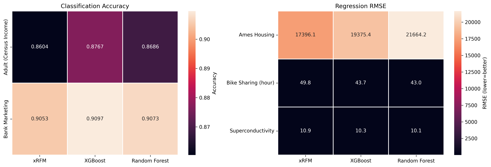
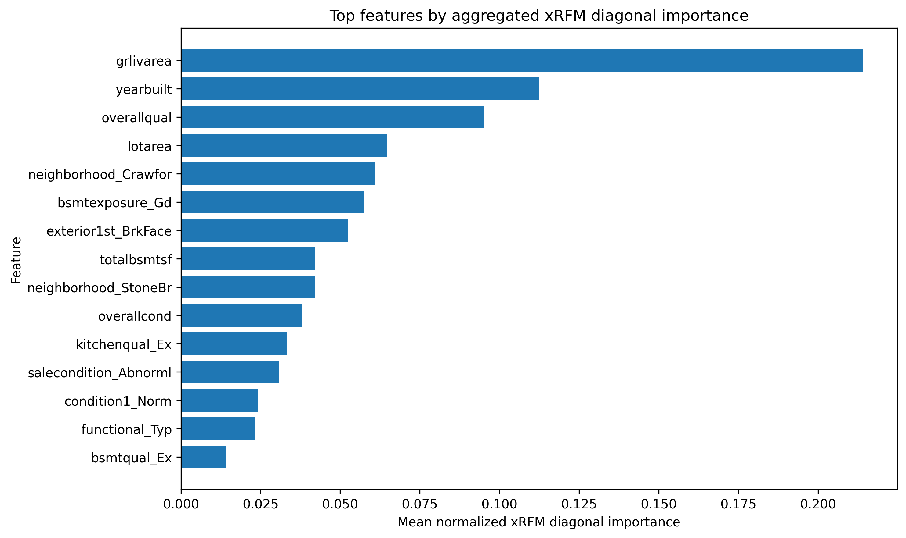
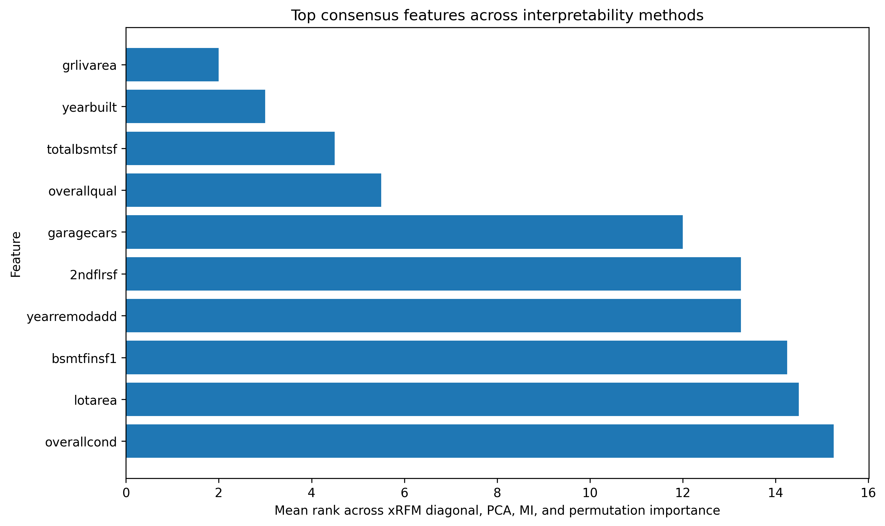
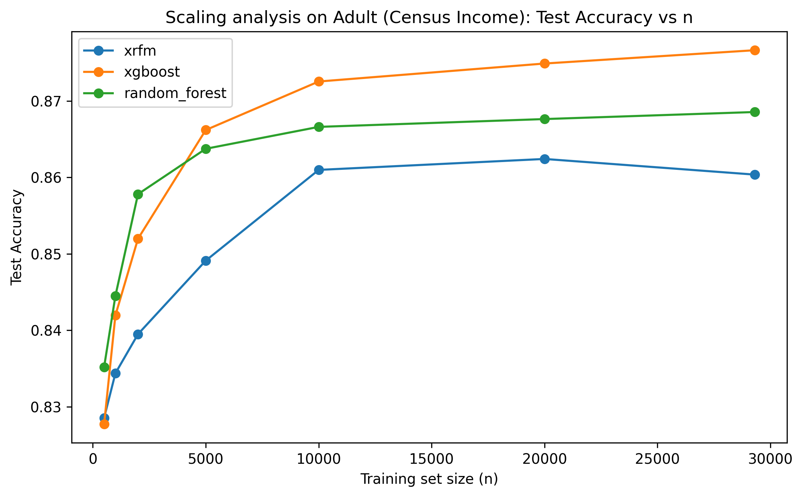
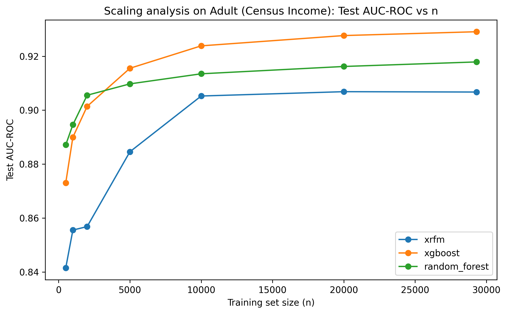
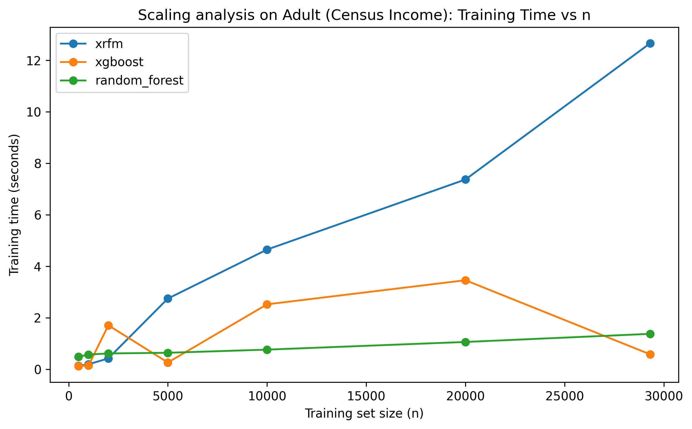
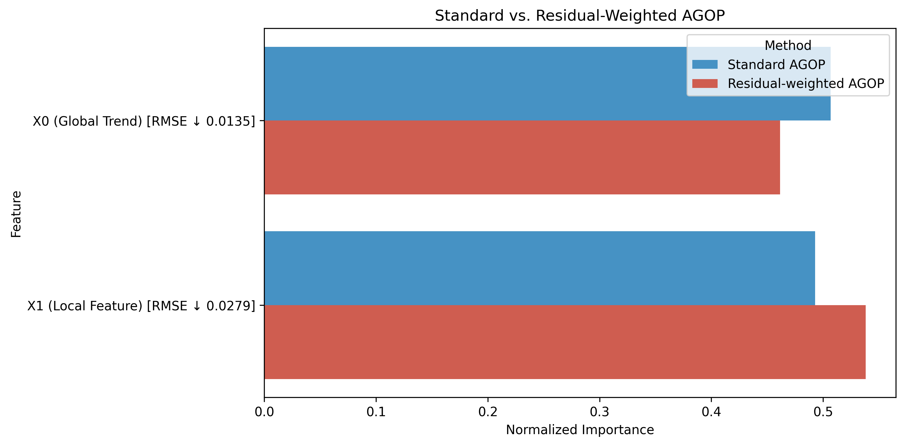

# Adaptive Kernel Feature Learning for Tabular Data

This project builds a tabular machine learning workflow to evaluate adaptive kernel feature learning with **xRFM** and compare it against strong tree-based baselines.

The workflow covers model training, validation-based model selection, test-set evaluation, runtime measurement, feature interpretability, scaling analysis, and a small residual-weighted AGOP exploratory analysis.



## Project Overview

Tabular data remains one of the most common data formats in applied machine learning. Unlike images or text, tabular datasets often contain mixed numerical and categorical variables, irregular feature distributions, missing values, and feature interactions that do not follow a clear spatial or sequential structure.

This project investigates how **xRFM**, an adaptive kernel-based model, behaves across different tabular settings and compares it with two widely used tree-based baselines:

* **xRFM**
* **XGBoost**
* **Random Forest**

The project evaluates the models across multiple datasets, task types, and analysis angles:

* prediction performance
* training and inference runtime
* feature interpretability
* scaling behaviour with increasing training size
* residual-weighted AGOP for high-error-region feature analysis

## Dataset Coverage

The main comparison uses **5 public tabular datasets** covering both classification and regression tasks.

| Dataset           | Task Type      | Main Role                                                   |
| ----------------- | -------------- | ----------------------------------------------------------- |
| Adult Income      | Classification | Large-sample mixed-feature dataset                          |
| Bank Marketing    | Classification | Binary classification dataset with class imbalance          |
| Ames Housing      | Regression     | High-dimensional mixed-feature dataset for interpretability |
| Superconductivity | Regression     | Large high-dimensional numerical regression dataset         |
| Bike Sharing      | Regression     | Medium-large mixed-feature regression dataset               |

The dataset selection provides coverage across:

* classification and regression tasks
* large-sample settings
* high-dimensional feature spaces
* mixed numerical and categorical feature spaces

## Data Sources

The datasets are loaded programmatically in the notebook rather than stored directly in this repository.

| Dataset           | Source                                                                                                                                                                                                                                       | Loading Method          |
| ----------------- | -------------------------------------------------------------------------------------------------------------------------------------------------------------------------------------------------------------------------------------------- | ----------------------- |
| Adult Income      | UCI Machine Learning Repository: https://archive.ics.uci.edu/dataset/2/adult                                                                                                                                                                 | `fetch_ucirepo(id=2)`   |
| Bank Marketing    | UCI Machine Learning Repository: https://archive.ics.uci.edu/dataset/222/bank+marketing                                                                                                                                                      | `fetch_ucirepo(id=222)` |
| Superconductivity | UCI Machine Learning Repository: https://archive.ics.uci.edu/dataset/464/superconductivty+data                                                                                                                                               | `fetch_ucirepo(id=464)` |
| Bike Sharing      | UCI Machine Learning Repository: https://archive.ics.uci.edu/dataset/275/bike+sharing+dataset                                                                                                                                                | `fetch_ucirepo(id=275)` |
| Ames Housing      | Public GitHub-hosted CSV sources used by the notebook: `https://raw.githubusercontent.com/eddiexunyc/DATA605_FINAL/main/Resources/train.csv` and `https://raw.githubusercontent.com/chriskhanhtran/kaggle-house-price/master/Data/train.csv` | `pandas.read_csv()`     |

Generated processed arrays and raw split files are saved locally under `data/processed/` when the notebook is run. These generated data files are not committed to the repository.

External datasets remain subject to their original access terms, licenses, and citation requirements.

## Methodology

### 1. Data Loading and Preprocessing

Each dataset is loaded into a unified feature-target format with metadata describing task type, target name, feature count, and feature categories.

The preprocessing pipeline includes:

* median imputation for numerical features
* standardisation for numerical features
* most-frequent imputation for categorical features
* one-hot encoding for categorical features
* label encoding for classification targets
* train / validation / test splitting

The project uses a **60/20/20 split**:

* training set for model fitting
* validation set for model selection
* test set for final reporting

Preprocessing is fitted only on the training split and then applied to validation and test splits to reduce data leakage risk.

### 2. Model Training and Selection

The main experiment compares **3 model families** across **5 datasets**, producing **15 selected-model result rows**.

The model-selection rule is:

> Validation set for model selection, test set for final reporting.

For regression tasks, the project records:

* RMSE
* training time
* inference time per sample

For classification tasks, the project records:

* accuracy
* AUC-ROC
* training time
* inference time per sample

### 3. Evaluation Tables

After training, the notebook cleans and saves model comparison outputs, including:

* full result table
* regression comparison table
* classification comparison table
* selected model parameters
* best model by dataset
* model win summary
* main performance heatmap

These outputs make it easier to inspect both predictive quality and computational cost.

## Interpretability Analysis

The interpretability analysis focuses on **Ames Housing**, which contains rich and meaningful tabular features. The workflow retrieves the validation-selected xRFM model and inspects its fitted feature matrices.

When direct AGOP matrices are not available, the notebook uses fallback diagonal matrix values as feature-activity indicators.

The interpretability workflow includes:

* xRFM diagonal feature-activity ranking
* PCA loading-based importance
* mutual information importance
* permutation importance
* cross-method ranking comparison
* top-k feature overlap analysis
* consensus and divergence feature summaries

This provides multiple views of feature importance and helps compare xRFM-specific feature activity with more standard interpretability methods.





## Scaling Analysis

The scaling analysis uses **Adult Income** as the large classification dataset.

The analysis compares how the three model families behave as the training size increases:

* xRFM
* XGBoost
* Random Forest

For each training subset, the notebook:

1. samples a smaller training set
2. fits a fresh preprocessor on that subset
3. keeps validation and test splits consistent
4. reuses validation-selected model parameters
5. records accuracy, AUC-ROC, training time, and inference time

The saved scaling figures include:







## Residual-Weighted AGOP Analysis

The project also includes a small exploratory analysis based on **residual-weighted AGOP**.

This analysis uses a synthetic regression setup with two feature roles:

* `X0` captures the main global trend
* `X1` becomes more important in a local high-error region

The notebook compares:

* standard AGOP
* residual-weighted AGOP

The residual-weighted version gives more influence to samples with larger prediction errors. A simple validation check then compares whether the selected feature helps reduce RMSE on high-residual samples.



## Key Outputs

The project saves outputs into structured folders.

### Main result files

| File                                           | Description                         |
| ---------------------------------------------- | ----------------------------------- |
| `results/main/full_results_clean.csv`          | Cleaned full model comparison table |
| `results/main/regression_report_table.csv`     | Regression result summary           |
| `results/main/classification_report_table.csv` | Classification result summary       |
| `results/main/selected_model_parameters.csv`   | Validation-selected parameters      |
| `results/main/best_model_by_dataset.csv`       | Best model summary by dataset       |
| `results/main/model_win_summary.csv`           | Model win-count summary             |

### Scaling files

| File                                        | Description                      |
| ------------------------------------------- | -------------------------------- |
| `results/scaling/scaling_summary_table.csv` | Long-format scaling result table |
| `results/scaling/scaling_pivot_table.csv`   | Side-by-side scaling comparison  |
| `results/scaling/scaling_results_final.csv` | Cleaned final scaling results    |

### Interpretability files

| File                                                       | Description                       |
| ---------------------------------------------------------- | --------------------------------- |
| `results/interpretability/interpretability_comparison.csv` | Cross-method rank comparison      |
| `results/interpretability/consensus_top_features.csv`      | Consensus feature summary         |
| `results/interpretability/divergence_top_features.csv`     | High-disagreement feature summary |
| `results/interpretability/overlap_summary.csv`             | Top-k overlap summary             |

### Figure files

| File                                              | Description                                   |
| ------------------------------------------------- | --------------------------------------------- |
| `figures/main_test_performance_summary.png`       | Main model performance heatmap                |
| `figures/scaling_accuracy_vs_n.png`               | Accuracy scaling curve                        |
| `figures/scaling_auc_vs_n.png`                    | AUC-ROC scaling curve                         |
| `figures/scaling_training_time_vs_n.png`          | Training-time scaling curve                   |
| `figures/agop_top15_features.png`                 | Top xRFM diagonal feature-activity scores     |
| `figures/interpretability_consensus_features.png` | Cross-method consensus feature plot           |
| `figures/residual_weighted_agop.png`              | Standard vs residual-weighted AGOP comparison |

## Repository Structure

```text
adaptive-kernel-feature-learning-tabular-data/
├── README.md
├── Adaptive_Kernel_Feature_Learning_for_Tabular_Data.ipynb
├── requirements.txt
├── .gitignore
├── figures/
│   ├── main_test_performance_summary.png
│   ├── scaling_accuracy_vs_n.png
│   ├── scaling_auc_vs_n.png
│   ├── scaling_training_time_vs_n.png
│   ├── agop_top15_features.png
│   ├── interpretability_consensus_features.png
│   └── residual_weighted_agop.png
└── results/
    ├── main/
    │   ├── best_model_by_dataset.csv
    │   ├── classification_report_table.csv
    │   ├── full_results_clean.csv
    │   ├── model_win_summary.csv
    │   ├── regression_report_table.csv
    │   └── selected_model_parameters.csv
    ├── scaling/
    │   ├── scaling_pivot_table.csv
    │   ├── scaling_results_final.csv
    │   └── scaling_summary_table.csv
    └── interpretability/
        ├── consensus_top_features.csv
        ├── divergence_top_features.csv
        ├── interpretability_comparison.csv
        └── overlap_summary.csv
```

## Execution Environment

This project was developed and executed in **Google Colab**.

The notebook uses Colab-style paths and runtime settings, including mounted Google Drive directories. For reproducibility, the recommended way to run this project is to open the notebook in Google Colab, install the listed dependencies, and run the cells in order.

Local cloning is mainly intended for reviewing the notebook, result tables, figures, and project structure. Running the notebook outside Colab may require manual changes to file paths, runtime settings, and dependency versions.

## How to Run in Colab

Install the dependencies:

```bash
pip install -r requirements.txt
```

Then open and run:

```text
Adaptive_Kernel_Feature_Learning_for_Tabular_Data.ipynb
```

The notebook will:

1. set up the environment
2. load the datasets programmatically
3. preprocess all datasets
4. train and tune the models
5. save result tables
6. run interpretability analysis
7. run scaling analysis
8. save key figures and output files

## Reproducibility Note

The result tables and figures in this repository correspond to one completed Colab run. Re-running the notebook may produce small differences because of package versions, hardware, runtime configuration, dependency updates, and model-level randomness.

The repository documents the completed workflow and generated outputs from that run. It is not packaged as a local command-line training pipeline.

## Technical Stack

* Python
* NumPy
* pandas
* scikit-learn
* PyTorch
* xRFM
* XGBoost
* Random Forest
* Matplotlib
* Seaborn
* UCI Machine Learning Repository API

## Project Highlights

* Built a reusable tabular machine learning pipeline across 5 datasets.
* Compared xRFM with XGBoost and Random Forest across classification and regression tasks.
* Used validation-based model selection and test-only final reporting.
* Recorded both predictive performance and runtime cost.
* Added xRFM-focused interpretability using diagonal feature-activity scores.
* Compared xRFM feature rankings with PCA, mutual information, and permutation importance.
* Analysed scaling behaviour across increasing training sizes.
* Explored residual-weighted AGOP for high-error-region feature analysis.

## Limitations and Future Work

The current workflow uses compact hyperparameter search spaces to stay practical in a Colab-style runtime.

The scaling analysis is based on fixed validation-selected parameters rather than full retuning at each training size.

Future extensions could include:

* broader hyperparameter search
* repeated scaling runs with multiple random subsamples
* testing residual-weighted AGOP on real datasets
* adding LightGBM as an additional tuned baseline
* comparing with other tabular models such as TabPFN
* deeper AGOP eigenvector analysis
* comparing AGOP-based feature importance with SHAP and tree-based feature importance

## Data and Reuse Notice

Raw datasets are not redistributed in this repository. Dataset loading is handled programmatically or through external public sources used by the notebook.

Generated processed datasets, local split files, model checkpoints, and raw dataset archives are not included in this repository.

External datasets, libraries, and models remain governed by their original licenses, access terms, and citation requirements.

No open-source license is currently granted for reuse or redistribution of this repository unless otherwise stated.

## References and Resources

This project builds on the xRFM framework proposed for scalable and interpretable feature learning on tabular data:

* Beaglehole, D., Holzmüller, D., Radhakrishnan, A., & Belkin, M. (2025). *xRFM: Accurate, scalable, and interpretable feature learning models for tabular data*. arXiv:2508.10053. https://arxiv.org/abs/2508.10053
* Official xRFM GitHub repository: https://github.com/dmbeaglehole/xRFM

The AGOP-based feature learning idea is based on Recursive Feature Machines:

* Radhakrishnan, A., Beaglehole, D., Pandit, P., & Belkin, M. (2024). *Mechanism for feature learning in neural networks and backpropagation-free machine learning models*. Science, 383(6690), 1461–1467. https://www.science.org/doi/10.1126/science.adi5639
* RFM arXiv version: https://arxiv.org/abs/2212.13881

Dataset sources used in this notebook:

* Adult Income: https://archive.ics.uci.edu/dataset/2/adult
* Bank Marketing: https://archive.ics.uci.edu/dataset/222/bank+marketing
* Superconductivity: https://archive.ics.uci.edu/dataset/464/superconductivty+data
* Bike Sharing: https://archive.ics.uci.edu/dataset/275/bike+sharing+dataset
* Ames Housing:

  * https://raw.githubusercontent.com/eddiexunyc/DATA605_FINAL/main/Resources/train.csv
  * https://raw.githubusercontent.com/chriskhanhtran/kaggle-house-price/master/Data/train.csv

Additional documentation:

* XGBoost documentation: https://xgboost.readthedocs.io/en/stable/
* scikit-learn documentation: https://scikit-learn.org/stable/
* UCI Machine Learning Repository API: https://pypi.org/project/ucimlrepo/

Additional tools and libraries used in this project include xRFM, XGBoost, scikit-learn, pandas, NumPy, PyTorch, Matplotlib, Seaborn, and the UCI Machine Learning Repository API.

## Summary

This project provides a structured evaluation of adaptive kernel feature learning for tabular data. It combines model comparison, runtime analysis, interpretability, scaling experiments, and a small AGOP-based exploratory analysis into one Colab-reproducible workflow.
